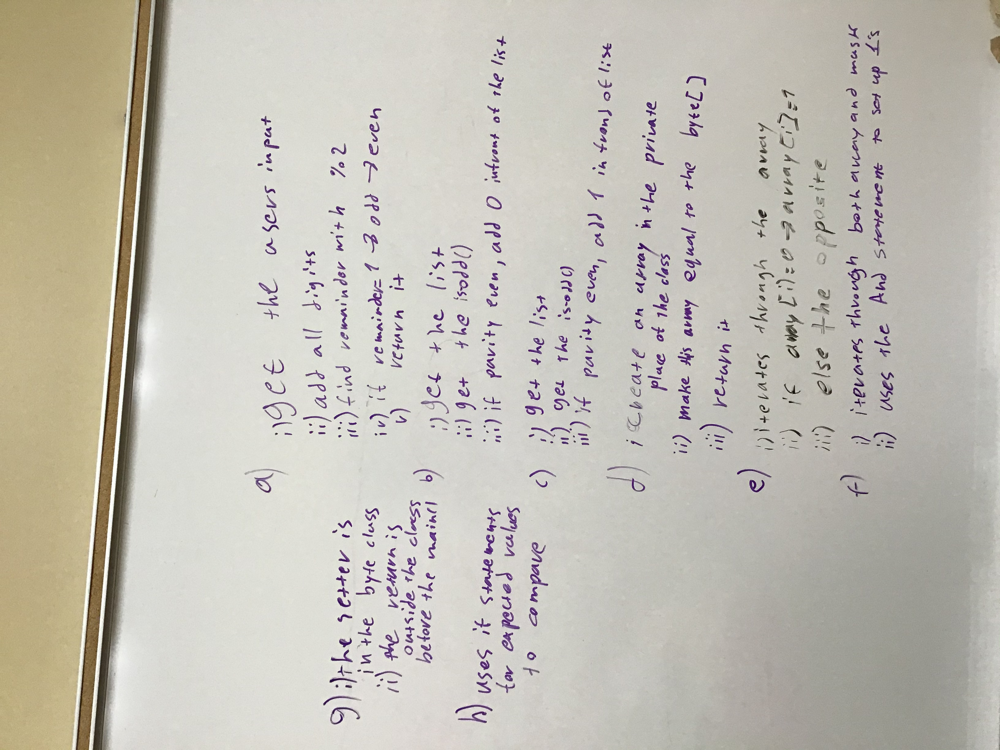

# L2: Bytes

## Lab designed to learn about bits, bytes, and binary
## and to reinforce working with C++ classes and arrays

## Author(s):
- Author of primary logic and code: Dimitrios Ntentia
- Author of stub: Jan Pearce, Berea College

# Planning Prompts

1. **WHITEBOARD DESIGN**
*Write a high level design plan for your program.
You can use screenshots of your work on an actual white board
or you can use pseudocode.*

2. **CRC Card**
*Complete a CRC Card for the Byte class. Be sure to keep this up to date.
I have given you some example rows. Add as many as you need.*

| **Name**                       | **Byte**  
| :----------------------------- | :--------------------------
| **Class Methods**              | **Collaborations**
| setrandom                      |  string  |
| set_byte                       |  iostream|
| show_byte                      |  random  |
| isodd
| seteven
| setodd
| returner
| flipper
| masker

| **Class Data**                |  **Collaborations**  
| intpar                        |  Random Calss	|
| parity						|  iostream     |
| byte
| mask

*OR Complete the CRC Card in the provided Google Doc and paste link to completed Google Doc here.*    

# Implementation and Customization Prompts

3. **PARITY PROBLEMS**
*Can you identify any possible problems with the parity method
of error detecting? If so, what are they, explain.
(There ARE problems with it, so typically more robust methods
are used when data integrity matters.)*

Parity can have several issues. First, if more than one bits get lost or are changed, then parity would not be able to detect the error. This is because parity has a value of either 0 or 1. When 2 bits change, parity cannot tell.

4. **PARITY SOLUTION**
*Can you think of an idea that would solve the problem(s) you identified?*
If for example we had parity checks, with the parity number being the sum of all bits then we would be able to tell for sure if there is an issue

5. **PROCESS SUMMARY**
*Briefly summarize your design and implementation process,
including how much your initial design plan evolved,
the final results you achieved, and the amount of time you spent
as a programmer or programmers in accomplishing these results.
This should be one or at most two paragraphs.*

In order to plan, I first wrote down the logic into high level pseudocode. After that, looking at the question
I decided and made a list of the variables that I would need for each function. The last part before writing
the function, was to figure out if a function needs to return something and if yes, then how and what the
output would look like. I would say that planning took more than 10 minutes for each function and writing along 
with debugging took another 20 per function. My original plan evolved a great amount, becuase I hadn't taken
into account the fact that I would need to test the funcitons, therefore I had to make the outputs meaningfull.

I am overall satisfied witht the results of my code and I am happy that it works. If I had extra time, I would 
definately work on the efficiency of the code, as well as limiting the use of local variables inside functions.

6. **IMPLEMENTATIONS**
*Please briefly describe what was accomplished including
the largest challenges overcome and any innovations that were not
specifically required by the assignment.*

I believe that the largest challenge was debugging. I would spend hours going back and checking my code, because 
the indicators given by visual studio would be very vague and a simple error would produce more. Though I accomplished
my goals, which were for the code to work and have meaningfull outputs.

7. **TESTING**
*Please briefly describe your testing process.
Here you should be careful to select representative input cases,
including both representative typical cases as well as extreme cases.*

For my testing process, I try to think of ways to cause an error. If it is a string, I will try giving it an integer and if it asks for an input, 
I will give it extreme values, or something that is unexpected, like a symbol.
This way I make sure to understand the flaws of my code and then I can go and fix them.
The main() function is the testing site, where I call all of my functions and I can observe the results.

8. **ERRORS**
*List in bulleted form of all known errors
and deficiencies with a very brief explanation.*

There should be no errors or bugs created by the code in the source file

9. **LEARNING AND REACTION**
*A paragraph or so of your own comments
on what you learned and your reactions to this lab.*

I learned a lot about debugging and how to work with classes. I think I would have enjoyed it better and would have been more familiar, if the only code provided was the code for the random generator. This way, I would have to think about the class and the public and private parts of it. Still I learned how to use the stops for the debugger and where to look at, when I get a runtime error.

10. **INTEGRITY STATEMENT**
I did not receive any help for submiting this lab

## References:
- This repo contains a stub by Jan Pearce
- Code from the book for overflowing an operator
